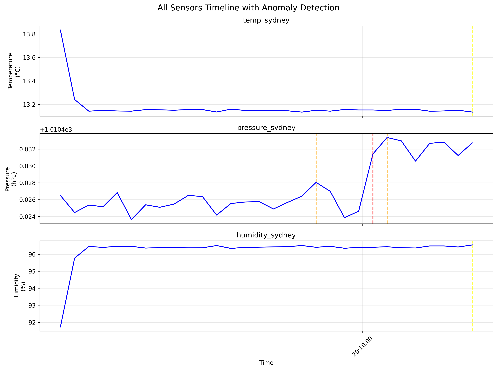
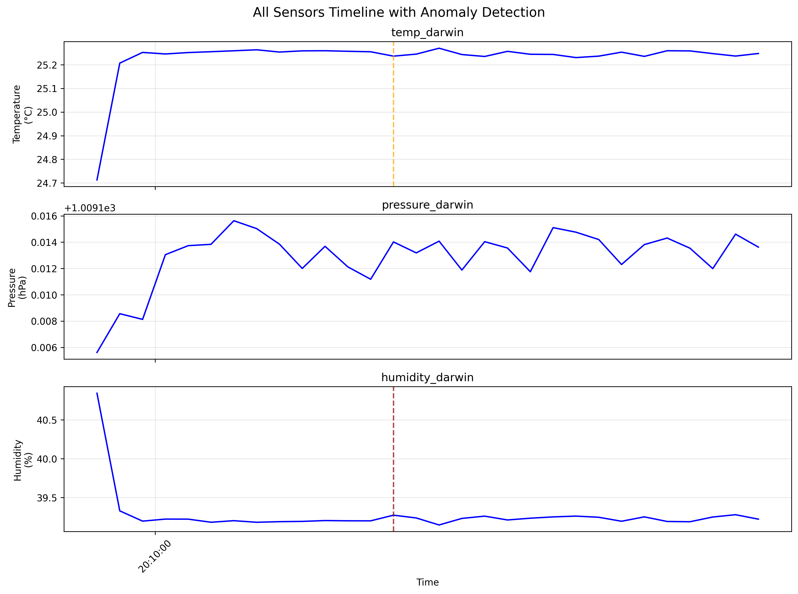

# Sensor Simulation & Anomaly Detection System

**Author: Grigor Crandon**  
**Date: August 2025**

A comprehensive Python-based sensor simulation framework with physics-based models, real-time anomaly detection, and professional reporting capabilities. Designed for IoT testing, data analysis, algorithm development, and educational demonstrations.

## 🌟 Features

### Physics-Based Sensor Simulation
- **Temperature Sensor**: Solar radiation calculations with seasonal variation and weather effects
- **Pressure Sensor**: Barometric formula with altitude correction and weather patterns  
- **Humidity Sensor**: Psychrometric relationships using Magnus formula with temperature coupling
- **Australian Climate Data**: Pre-configured settings for 10+ Australian cities with accurate parameters
- **Realistic Characteristics**: Configurable noise, drift, calibration errors, and malfunction simulation
- **Sensor Calibration**: Built-in calibration system with reference value correction and drift preservation
- **Smart Sensor IDs**: Automatic normalization of sensor IDs (e.g., "Alice Springs" → "temp_alice_springs")

### Real-Time Anomaly Detection
- **Rule-Based Thresholds**: Environmental alerts (frost < -5°C, heat > 30°C, extreme > 35°C, pressure < 950/> 1050 hPa)
- **Statistical Z-Score Analysis**: Rolling window detection with customisable thresholds (default 3.0)
- **Severity Grading**: Automatic classification (LOW → MEDIUM → HIGH → CRITICAL)
- **Stream Processing**: Memory-efficient detection for continuous monitoring

### Professional Reporting & Visualisation
- **Statistical Reports**: Comprehensive sensor statistics with automatic location detection
- **Color-Coded Alert Summaries**: Terminal output with severity color coding (Yellow/Orange/Red/Magenta)
- **Dynamic Alert Generation**: Fresh alerts generated for each dataset, no stale cached data
- **Timeline Plots**: 
  - Multi-sensor subplot visualisation with coordinated timelines
  - Single sensor detailed plots with alert markers
  - PNG output with comprehensive severity legend
  - Professional formatting with color-coded alert markers
- **Data Export**: NDJSON format with location metadata for streaming integration

### Command Line Interface
```bash
# Generate realistic sensor data with location metadata
python cli.py simulate --duration 60 --location Brisbane --interval 0.5

# Auto-generate fresh reports with dynamic location detection
python cli.py report --data data/readings.ndjson

# Generate specific city data with custom parameters  
python cli.py simulate --duration 120 --location "Alice Springs" --interval 1.0 --output data/alice.ndjson
python cli.py report --data data/alice.ndjson --plot-sensor temp_alice_springs

# Legacy manual workflow (optional)
python cli.py detect --input data/readings.ndjson --z-threshold 2.5 --window-size 15
python cli.py report --data data/readings.ndjson --alerts out/alerts.ndjson
```

## � Example Output

The system generates professional multi-sensor visualisations with alert markers:



*Multi-sensor timeline showing temperature, pressure, and humidity data from Sydney with statistical anomaly detection alerts.*

## �🚀 Quick Start

### Installation from GitHub

```bash
# Clone the repository
git clone git@github.com:GrigoriusPompeus/sensor-data-sim-and-anomaly-detection.git
cd sensor-data-sim-and-anomaly-detection

# Create virtual environment
python -m venv .venv

# Activate virtual environment
# On macOS/Linux:
source .venv/bin/activate
# On Windows:
# .venv\Scripts\activate

# Install dependencies
pip install -r requirements.txt

# Verify installation
python test_imports.py
```

### Dependencies
```
numpy>=1.21.0           # Mathematical operations and arrays
pandas>=1.3.0           # Data manipulation and analysis  
matplotlib>=3.4.0       # Plotting and visualisation
scipy>=1.7.0            # Statistical functions
pyyaml>=5.4.0           # Configuration file parsing
click>=8.0.0            # Command line interface
pytest>=6.2.0          # Testing framework
pytest-cov>=2.12.0     # Test coverage reporting
```

### Quick Demo
```bash
# Run the complete system demonstration
python demo.py
```

## 📋 Complete Usage Guide

### 1. Data Simulation
```bash
# Basic simulation (60 seconds, Sydney)
python cli.py simulate

# Custom parameters
python cli.py simulate --duration 120 --interval 0.5 --location Melbourne --output data/my_data.ndjson

# Available locations: Sydney, Melbourne, Brisbane, Perth, Adelaide, Darwin, Hobart, Canberra, Alice Springs, Cairns
```

### 2. Smart Reporting (Recommended)
```bash
# Auto-generate reports with fresh alerts (recommended workflow)
python cli.py report --data data/readings.ndjson

# Multi-city comparison
python cli.py simulate --duration 60 --location Darwin --output data/darwin.ndjson
python cli.py simulate --duration 60 --location Melbourne --output data/melbourne.ndjson
python cli.py report --data data/darwin.ndjson      # Shows "Darwin" with tropical data
python cli.py report --data data/melbourne.ndjson  # Shows "Melbourne" with temperate data

# Single sensor focus
python cli.py report --data data/readings.ndjson --plot-sensor temp_sydney
```

### 3. Manual Anomaly Detection (Optional)
```bash
# Manual detection workflow (alerts stored separately)
python cli.py detect --input data/readings.ndjson --z-threshold 2.0 --window-size 20
python cli.py report --data data/readings.ndjson --alerts out/alerts.ndjson
```

## 🧪 Testing & Validation

### Run All Tests
```bash
# Run comprehensive test suite (recommended)
python run_all_tests.py

# Or run individual tests:
# Test imports and basic functionality
python test_imports.py

# Test all sensor implementations
python test_all_sensors.py

# Test active anomaly detection rules
python test_active_rules.py

# Test extreme temperature scenarios
python test_extreme_temp.py

# Test extreme values across all sensors
python test_extreme_values.py

# Test individual sensor creation
python test_sensor.py

# Test sensor calibration functionality
python test_calibration.py

# Test sensor ID normalization
python test_sensor_ids.py
```

### Expected Test Results
- **Import Test**: Verifies all dependencies and sensor classes load correctly
- **Sensor Test**: Validates physics calculations and realistic value generation
- **Rules Test**: Confirms 7 active anomaly detection rules are working correctly
- **Extreme Tests**: Validates system behavior under edge conditions
- **Individual Tests**: Basic sensor creation and reading functionality
- **Calibration Test**: Verifies sensor calibration accuracy and drift preservation
- **Sensor ID Test**: Validates normalized sensor ID generation for cities with spaces

## 📊 Data Formats

### NDJSON Sensor Readings
```json
{"value": 23.5, "timestamp": "2025-08-15T19:31:33.060167", "sensor_id": "temp_sydney", "sensor_type": "temperature", "quality": 0.99, "metadata": {"base_value": 23.48, "drift_applied": 0.02, "calibration_offset": 0.0, "noise_level": 0.01, "location": "Sydney"}}
```

### NDJSON Alert Format  
```json
{"timestamp": "2025-08-15T19:31:47.060167", "sensor_id": "temp_sydney", "sensor_type": "temperature", "rule_name": "z_score_3.0", "severity": "medium", "value": 25.7, "threshold": 3.0, "message": "Statistical anomaly detected: temperature value 25.70 has z-score 3.46", "metadata": {"rule_type": "z_score", "z_score": 3.46, "window_size": 10}}
```

## 🔧 Programmatic Usage

### Basic Sensor Creation and Reading
```python
from src.sensors import TemperatureSensor, PressureSensor, HumiditySensor
from datetime import datetime

# Create individual sensors
temp_sensor = TemperatureSensor(location="Melbourne")
pressure_sensor = PressureSensor(location="Melbourne", altitude=31)
humidity_sensor = HumiditySensor(location="Melbourne", location_type="urban")

# Activate sensors before reading
for sensor in (temp_sensor, pressure_sensor, humidity_sensor):
    sensor.activate()

# Generate readings
timestamp = datetime.now()
temp_reading = temp_sensor.read(timestamp)
pressure_reading = pressure_sensor.read(timestamp)
humidity_reading = humidity_sensor.read(timestamp)

print(f"T:{temp_reading.value:.1f}°C P:{pressure_reading.value:.1f}hPa H:{humidity_reading.value:.1f}%RH")
```

### Coordinated Multi-Sensor Simulation
```python
from src.data.generator import DataGenerator, SensorNetwork

# Create coordinated sensor network
network = SensorNetwork(location="Brisbane", update_interval=1.0)
generator = DataGenerator(network)

# Stream coordinated readings
for reading_group in generator.stream_readings():
    temp = reading_group['temperature'].value
    pressure = reading_group['pressure'].value  
    humidity = reading_group['humidity'].value
    print(f"T:{temp:.1f}°C P:{pressure:.1f}hPa H:{humidity:.1f}%RH")
```

### Sensor Calibration
```python
from src.sensors import TemperatureSensor

# Create and activate sensor
sensor = TemperatureSensor(location="Melbourne")
sensor.activate()

# Take initial reading
reading = sensor.read()
print(f"Initial reading: {reading.value:.2f}°C")

# Calibrate against known reference value
reference_temperature = 25.0  # Known accurate reference
sensor.calibrate(reference_value=reference_temperature, actual_value=reading.value)

# Subsequent readings will be corrected
corrected_reading = sensor.read()
print(f"Calibrated reading: {corrected_reading.value:.2f}°C")
```

### Anomaly Detection
```python
from src.anomaly.detector import AlertManager
from src.anomaly.rules import RuleBasedDetector
from src.anomaly.statistics import ZScoreDetector

# Setup detection
alert_manager = AlertManager()
alert_manager.add_detector(RuleBasedDetector())
alert_manager.add_detector(ZScoreDetector(window_size=10, z_threshold=3.0))

# Process readings
for reading_group in generator.stream_readings():
    for sensor_type, reading in reading_group.items():
        if sensor_type != 'timestamp':
            alerts = alert_manager.process_reading(reading)
            for alert in alerts:
                print(f"🚨 {alert.severity.value.upper()}: {alert.message}")
```

### Reporting and Visualisation
```python
from src.reporting.stats import StatsReporter
from src.reporting.alerts import AlertSummary
from src.reporting.plots import PlotGenerator

# Generate statistics
stats = StatsReporter()
stats.add_readings(readings)
stats.print_report()

# Summarize alerts  
alert_summary = AlertSummary()
alert_summary.add_alerts(alerts)
alert_summary.print_summary()

# Create plots
plotter = PlotGenerator()
plotter.plot_multiple_sensors(readings, alerts, output_path="my_plot.png")
```

## 🌍 Australian Climate Locations

Pre-configured with accurate climate data:

| City | Altitude | Climate Type | Features |
|------|----------|--------------|----------|
| Sydney | 19m | Temperate oceanic | Coastal, moderate |
| Melbourne | 31m | Temperate oceanic | Variable weather |
| Brisbane | 27m | Subtropical | Warm, humid |
| Perth | 46m | Mediterranean | Dry summers |
| Adelaide | 50m | Mediterranean | Hot, dry |
| Darwin | 30m | Tropical savanna | High humidity |
| Hobart | 51m | Oceanic | Cool, maritime |
| Canberra | 580m | Continental | Elevated, variable |
| Alice Springs | 545m | Arid continental | Desert, extreme range |
| Cairns | 3m | Tropical | Coastal, wet/dry seasons |

## 🔍 Anomaly Detection Rules

### Default Threshold Rules
- **High Temperature**: > 30°C (MEDIUM), > 35°C (HIGH)
- **Low Temperature**: < -5°C (HIGH - frost conditions)
- **Pressure Bounds**: < 950 hPa or > 1050 hPa (MEDIUM)
- **Humidity Bounds**: < 0% or > 100% (CRITICAL - sensor malfunction)

### Statistical Detection
- **Method**: Rolling z-score with configurable window
- **Default Settings**: 10-sample window, z-threshold = 3.0
- **Severity Grading**: Based on z-score magnitude (3.0→MEDIUM, 4.0→HIGH, 5.0→CRITICAL)

## 📈 Performance Metrics

- **Generation Rate**: 10+ readings/second per sensor (30+ total)
- **Memory Usage**: Minimal (streaming generators, no large data storage)
- **File Sizes**: 
  - 20 seconds data: ~28KB NDJSON (120 readings)
  - Anomaly alerts: ~1.1KB NDJSON (2 alerts)
  - Multi-sensor plot: ~309KB PNG
- **Behaviour**: Physics-based models provide realistic sensor behaviour

## 🎯 Use Cases

### IoT System Testing
- Validate monitoring systems before production deployment
- Test data pipelines with realistic sensor streams
- Simulate sensor failures and anomalies

### Algorithm Development  
- Develop and test anomaly detection algorithms
- Train machine learning models with labeled data
- Benchmark performance with known patterns

### Education & Training
- Demonstrate sensor networks and data analysis
- Teach anomaly detection concepts with visual examples
- Provide realistic datasets for student projects

### Proof of Concepts
- Rapidly prototype monitoring solutions
- Generate demonstration data for presentations
- Test visualisation and dashboard systems

## 📁 Project Structure

```
sensor-sim/
├── src/                          # Core source code
│   ├── sensors/                  # Sensor implementations
│   │   ├── base_sensor.py           # Abstract base class with quality simulation
│   │   ├── temperature.py           # Solar radiation physics model
│   │   ├── pressure.py              # Barometric formula calculations  
│   │   └── humidity.py              # Psychrometric relationships
│   ├── data/                     # Data generation
│   │   └── generator.py             # Multi-sensor coordination and streaming
│   ├── anomaly/                  # Anomaly detection
│   │   ├── detector.py              # Base detection framework
│   │   ├── rules.py                 # Rule-based threshold detection
│   │   └── statistics.py            # Statistical z-score detection
│   └── reporting/                # Analysis and visualisation
│       ├── stats.py                 # Statistical reporting
│       ├── alerts.py                # Alert summarization
│       └── plots.py                 # Plot generation with matplotlib
├── config/                       # Configuration files
├── data/                         # Generated sensor data (NDJSON)
├── out/                          # Output reports and plots
├── cli.py                        # Command line interface
├── demo.py                       # Complete system demonstration
├── test_*.py                     # Test suite files
├── requirements.txt              # Python dependencies
└── README.md                     # This documentation
```

## 🧪 Example Output

### Statistics Report
```
============================================================
SENSOR STATISTICS REPORT  
============================================================
Total Readings: 360
Unique Sensors: 3
Sensor Types: temperature, pressure, humidity

Detailed Statistics by Sensor:
--------------------------------------------------------------------------------
Sensor ID       Type         Count    Mean       Min        Max        StdDev  
--------------------------------------------------------------------------------
temp_brisbane   temperature  120      19.10      19.07      19.19      0.01    
pressure_brisbane pressure   120      1009.29    1009.29    1009.30    0.00    
humidity_brisbane humidity   120      61.65      61.23      61.78      0.06    
--------------------------------------------------------------------------------
```

### Alert Summary
```
============================================================
ALERT SUMMARY REPORT
============================================================
Total Alerts: 12

Alerts by Severity:
------------------------------
  LOW       :   8
  MEDIUM    :   4

Recent Alerts (last 10):
--------------------------------------------------------------------------------
Time                 Sensor          Rule                 Severity   Value     
--------------------------------------------------------------------------------
19:34:39             pressure_brisbane z_score_2.5          low        1009.27   
19:34:47             temp_brisbane   z_score_2.5          low        19.12     
--------------------------------------------------------------------------------
```

## 📚 Documentation

### Generated Output Examples

**Sydney Environmental Monitoring (Winter)**


**Darwin Tropical Climate (Summer)** 


*Both examples show the multi-sensor timeline visualisation with coordinated temperature, pressure, and humidity readings. Alert markers indicate detected anomalies using statistical z-score analysis.*

### Detailed Reference
- **[SENSOR_CALCULATIONS.md](SENSOR_CALCULATIONS.md)** - Complete physics models, calculation methods, and threshold documentation
- **[QUICKREF.md](QUICKREF.md)** - Quick reference for commands and parameters

---

**Created by Grigor Crandon - August 2025**  
A professional-grade sensor simulation and anomaly detection framework for IoT, research, and education.
